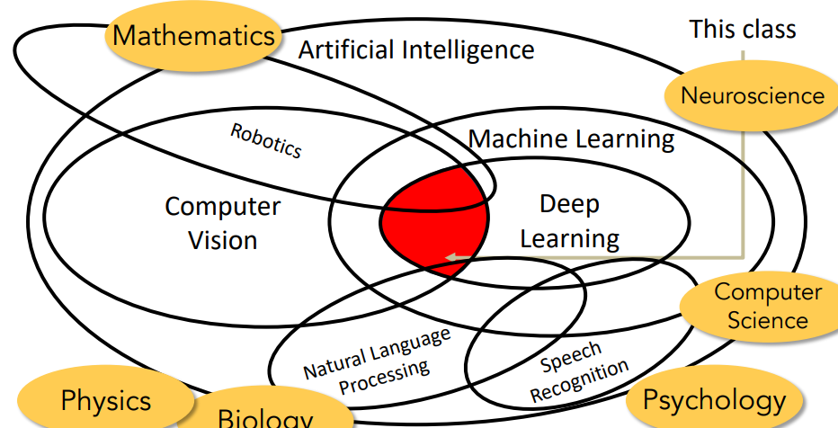
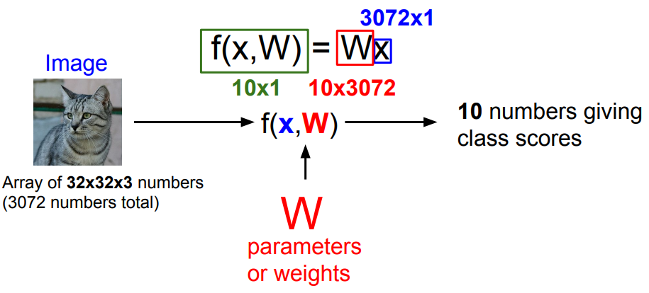

这篇博客流水线的记录一下自己学习[CS231n](http://cs231n.stanford.edu/schedule.html)的笔记。

## 1 Computer Vision Overview

## 2 Image Classification with Linear Classifiers

### The image classification

图像分类是CV领域中最核心任务之一。它指的是，给定一些标签并将图片预测为一个或多个预定义类别中的过程。

一些潜在的挑战包括：

- Viewpoint variation
- Illumination
- Background Clutter
- Occlusion
- Deformation

### Machine Learning: Data-Driven Approach

使用机器学习解决图像分类的流程是：

- 收集数据并定义标签；
- 使用机器学习算法训练分类器；
- 在测试集上评估分类器的准确率。

### Nearest Neighbor

邻近算法的核心思想就是:

- 确定测试实例与每个训练实例的距离(相似程度);
- 从中选择距离最小的那个训练实例，称为"最近的邻居";
- 将测试实例预测为这个"最近邻居"的类别。

值得注意的是，近邻算法是"惰性学习"模型家族的一部分，这意味着它不会根据训练集主动学习或者拟合出一个函数来对新进入的样本进行判断，而是单纯的记住训练集中所有的样本，所以它实际上没有所谓的"训练"过程，而是在需要进行预测的时候从自己的训练集样本中查找与新进入样本最相似的样本，即寻找最近邻来获得预测结果。

**Distance Metric**：

一些常见的距离度量方法包括：

- L1 Manhattan distance $1$
- L2 Euclidean distance

**K Nearest Neighbor**：

k邻近算法是使用离待测试点k个最近邻的点来对分类进行预测的一种算法。相比普通最近邻算法只考虑测试实例的单一最近邻居，而k邻域算法考虑测试实例的k个最近邻居。

对于分类问题，k邻域算法通过majority voting的方式从k个最近邻居中获得最常见的类别作为预测类别，即：选择k个邻居中频率最高的类别作为返回值。

**Hyperparameters**：

在机器学习中，超参数是在开始学习过程之前设置用于控制学习过程的参数，而不是通过训练得到的参数数据。

**Cross-Validation**：

交叉验证在训练集和测试集的基础上，通过进一步将训练数据集随机平均划分为K个互不重叠的子集，然后将其中一个子集作为验证集，其余K-1个子集作为临时训练集。这样循环K次，每次选择一个不同的验证集，其余作为临时训练集，取平均值作为最终估计值。

因为交叉验证可以重复利用原始数据集，较好地评估不同超参数设置下的泛化能力，所以它一般常用来确认和选择模型的超参数。

### Linear Classifier

**How To Choose A Good Linear Classifier**：

- 定义一个损失函数，用于反映模型预测效果；
- 优化模型参数来减小损失函数的值。

**Loss Function**：

$
L = \frac{1}{N} \sum_{i}
$

### Softmax Classifier

> 回归 vs 分类：定量输出称为回归，或者说是连续变量预测； 定性输出称为分类，或者说是离散变量预测。

## 3 Regularization and Optimization

## 5 Image Classification with CNNs

### Full Connected Layer

全连接层

### Convotional Layer

### Pooling Layer

## 6 CNN Architectures
