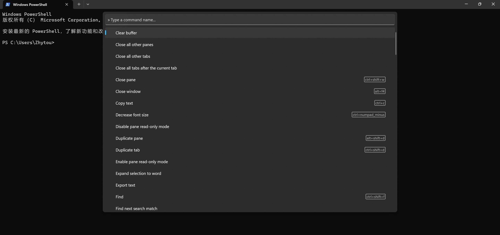

随着Coding的时间越来越长，我接触到的工具也越来越多，也逐渐有了一套自己的工具包。这篇博客就记录了我对WSL、Docker、Shell、SSH、TMux和Vim等工具的学习和使用笔记以及一些环境配置。

## Virtual Machine & Containerization

首先，介绍一下最基础也是最常见的虚拟化工具。由于我们的电脑一般是Windows，但课程实验往往要求Unix/Linux的开发环境，此时我们就需要使用虚拟化技术来模拟目标环境。

使用虚拟化技术的好处如下：

- 更高效利用物理服务器资源。一个物理服务器可以运行多个虚拟机,更充分地利用CPU、内存和存储资源。
- 更高的弹性和可扩展性。通过克隆和删除虚拟机,可以快速实现应用程序的弹性伸缩。
- 更好的隔离性。虚拟机相互隔离,不会相互影响。如果一个虚拟机宕机,也不会影响其他虚拟机。
- 更方便的测试和开发。可以快速部署虚拟机用于软件测试和开发。

而虚拟机（Virtual Machine，VM）和容器化（Containerization）是两种重要的虚拟化技术。二者区别如下：

下面介绍最常用的两种虚拟化工具WSL和Docker。

### WSL

**Introduction**：

适用于Linux的Windows子系统（Windows Subsystem for Linux，WSL）是一个为了在Windows操作系统上能够原生运行Linux二进制可执行文件（ELF格式）的兼容层。

**Setup**：

简单来说，可以把WSL想象成Windows自带的Linux虚拟机，但是它并不是默认开启的，需要先检测是否支持，然后再将其在设置中打开。具体步骤如下：

### Docker

**Introduction**：

Docker 是一种轻量级的虚拟化解决方案，可以将应用程序和其依赖项打包成一个可移植的容器，然后在不同的环境中运行。Docker 容器包含了运行应用程序所需的所有组件，包括代码、运行时、系统工具、系统库等，因此可以确保应用程序在不同的环境中都能够稳定运行。

**Notion**：

镜像（Image）是一个只读的模板，用于创建 Docker 容器。比如官方镜像 ubuntu:16.04 就包含了完整的一套 Ubuntu16.04 最小系统的 root 文件系统。

容器（Container）是 Docker 运行时的实例。它和镜像的关系就像是面向对象程序设计中的类和实例一样，镜像是静态的定义，容器是镜像运行时的实体。容器可以被创建、启动、停止、删除、暂停等。

仓库（Repository）是用于存储 Docker 镜像的地方，可以理解为一个代码库。

**Setup**：

### Other Virtualization Tool

除了上面提到的WSL和Docker两种最重要的虚拟化工具，我在这里补充一些其他常用的软件或工具：

**BusyBox**：嵌入式 Linux 的瑞士军刀

**Virtual Box**：虚拟机软件

## Shell

Shell是Unix/Linux操作系统下传统的用户和电脑的交互界面，是一种典型的命令行接口（Command Line Interface，CLI）程序。

此外，我们有时也以Shell代指Shell编程语言（Shell Programming Language）。它是一门 “能够把用户指令翻译成系统调用” 的编程语言，而由Shell Language所编写的程序则被称为Shell脚本（Shell Scripts）。因此，Shell也可以理解成控制系统的脚本语言的解释器。

补充：你可以阅读这篇[实验指南](https://jyywiki.cn/OS/2022/labs/M4)来了解如何实现一个类似Python Shell的交互式Shell。

### Basic Functions

Shell提供了很多功能：

**重定向 Redirections**：

**别名 Aliases**：

**管道 Pipeline**：

此外，Shell作为一门编程语言，也类似其他语言一样提供了运算符、参数、变量、函数、流控制等功能。

### Simple Usage

下面介绍一些Shell最常见的功能和命令。

**GNU Tools**：

更多介绍可以阅读我的另一篇博客[一文了解GNU Tools](https://zhytou.top/post/2023-6-27/gnu-tools/)。

**Hard Link**：

### Prettifying

**Oh-My-Zsh**：

**Oh-My-Posh**:

### Remote Shell(SSH)

SSH(Secure Shell)提供安全的远程登录和命令执行功能。

## Terminal & Job Control

终端（Terminal）早期是指一种允许工程师向计算机发送指令并观察其运行结果的硬件设备，但现在我们一般所说的终端其实都是终端模拟器（Terminal Emulator），即使用软件模拟文本输入输出的界面。

### Use Windows Terminal

**Shortcuts**:

- 打开/关闭终端：Ctrl+Alt+T 或 Win+Shift+Enter
- 创建新的标签页：Ctrl+Shift+T
- 关闭标签页：Ctrl+Shift+W
- 切换标签页：Ctrl+Tab 或 Ctrl+Shift+Tab
- 切换全屏模式：F11
- 缩放终端：Ctrl+鼠标滚轮 或 Ctrl++/-
- 复制文本：Ctrl+Shift+C
- 粘贴文本：Ctrl+Shift+V
- 打开命令面板：Ctrl+Shift+P 或 F1
- 改变字体大小：Ctrl+鼠标滚轮
- 以管理员身份运行当前终端：Ctrl+Shift+Enter

### Use TMux to Multliplex

### Dotfiles

点文件（Dotfiles）指Unix/Linux系统用户主目录下以点开头的纯文本配置文件。因为它们默认是隐藏文件，所以ls并不会显示它们。

对于 bash来说，在大多数系统下，您可以通过编辑 .bashrc 或 .bash_profile 来进行配置。此外，还有一些常见的配置文件如下：

- git - ~/.gitconfig
- vim - ~/.vimrc 和 ~/.vim 目录
- ssh - ~/.ssh/config
- tmux - ~/.tmux.conf

我们在它们所在的文件夹下使用版本控制系统进行管理，然后通过脚本将其符号链接到需要的地方。这么做有如下好处：

- 安装简单: 如果您登录了一台新的设备，在这台设备上应用您的配置只需要几分钟的时间；
- 可移植性: 您的工具在任何地方都以相同的配置工作
- 同步: 在一处更新配置文件，可以同步到其他所有地方
- 变更追踪: 您可能要在整个程序员生涯中持续维护这些配置文件，而对于长期项目而言，版本历史是非常重要的

我们可以参考这个[网站](https://dotfiles.github.io/)了解如何个性化的配置自己的点文件，也可以参考[他人的配置文档](https://github.com/search?o=desc&q=dotfiles&s=stars&type=Repositories)进行修改。

## Other

### Vim

### CI

## Reference

- [MIT-The Missing Semester of Your CS Education](https://missing.csail.mit.edu/2020/command-line/)
- [NJU-OS笔记 13 Shell](https://zhytou.top/post/2023-6-19/nju-os/)
