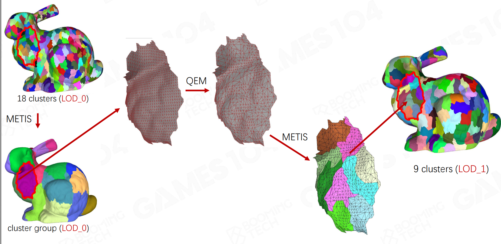

- [Bottleneck of Traditional Rendering Pipeline](#bottleneck-of-traditional-rendering-pipeline)
- [Key Ideas of GPU-Driven Pipeline](#key-ideas-of-gpu-driven-pipeline)
  - [Indirect Draw](#indirect-draw)
  - [Compute Shader](#compute-shader)
  - [GPU-Driven Culling](#gpu-driven-culling)
  - [Mesh Cluster Rendering](#mesh-cluster-rendering)
- [Nanite: State-of-the-Art in GPU-Driven Pipeline Architecture](#nanite-state-of-the-art-in-gpu-driven-pipeline-architecture)
  - [Geometory Represetation](#geometory-represetation)
  - [Runtime LoD Selection](#runtime-lod-selection)
  - [Nanite Rasterization](#nanite-rasterization)
  - [Summary](#summary)
- [Reference](#reference)

GPU驱动管线（GPU-Driven Pipeline）是一种将原本由CPU承担的大量渲染任务转移到GPU上进行处理的渲染管线架构。在传统渲染管线中，CPU负责管理场景中的大量数据，如模型的加载、裁剪、排序以及绘制调用的提交等，这使得CPU成为渲染流程中的瓶颈。而GPU驱动管线则通过Indirect Draw、Compute Shader等机制让GPU能够更自主地处理这些任务，充分发挥其强大的并行计算能力，从而突破了渲染性能。

## Bottleneck of Traditional Rendering Pipeline

1. **High CPU overload**

- 视锥/遮挡裁剪
- 准备drawcall

2. **CPU can not follow up GPU**

- 随着GPU硬件发展，CPU处理速度逐渐难以跟上专用于图像处理的GPU了

3. **GPU state exchange overhead when solving large amount of drawcalls**

- 每次处理drawcall时，GPU都需要切换状态

## Key Ideas of GPU-Driven Pipeline

### Indirect Draw

**Draw from GPU buffer**

GPU驱动管线的核心目标是最小化CPU参与渲染流程的频率。传统绘制方式（如 glDrawArray/glDrawElements）需由CPU直接传递绘制参数（如图元数量、索引范围等），这会导致CPU-GPU通信开销较高。间接绘制则将这些参数存储在GPU可访问的缓冲区中，由GPU自行读取参数并执行绘制，从而大幅减少CPU的介入。

**New api support**

```glsl
// CPU直接传递参数
glDrawElements(GL_TRIANGLES, 6, GL_UNSIGNED_INT, 0); 

// 参数来自GPU缓冲区
glDrawElementsIndirect(GL_TRIANGLES, GL_UNSIGNED_INT, buffer_offset);
```

尽管早期的渲染API（如 OpenGL 4.x）已引入了间接绘制指令，但受限于其状态机架构与隐式同步机制，CPU仍需承担较重的指令验证负担。而Vulkan和DX12等新一代API通过底层重构，彻底释放了GPU-Driven Rendering的潜力。以Vulkan为例，它相比OpenGL，做了如下优化：

- 高度并行的多线程指令录制：Vulkan彻底摒弃了OpenGL的单线程状态机限制。它允许开发者为每个线程创建独立的命令缓冲（Command Buffer），每个缓冲均封装了完整的渲染状态。这种设计消除了线程间的竞争与上下文切换开销，使CPU的多核性能在指令录制阶段得到充分爆发。

- 显式的同步与执行控制：虽然不同线程可以并行录制，但GPU执行指令通常遵循特定的逻辑顺序。Vulkan不再依赖驱动进行同步，而是提供了屏障（Barriers）、栅栏（Fences）和信号量（Semaphores）等精细化工具。开发者通过这些机制手动确保显存可见性与执行时序，在消除隐式同步卡顿的同时，保证了渲染结果的确定性。

- 精细化的资源与生命周期管理：在Vulkan中，内存分配、资源绑定以及缓冲区的生存周期完全交由开发者掌控。这种“所见即所得”的模式消除了传统API内部频繁的引用计数与自动内存重排开销，大幅降低了驱动层的CPU占用（Driver Overhead），使每一份算力都精准作用于渲染流水线。

### Compute Shader

**High-speed general purpose computing**

为了动态生成间接绘制的参数，现代渲染管线又引入了另一项关键技术，也即通用计算着色器Compute Shader。与传统的Vertex Shader和Fragment Shader不同，Compute shader不直接参与图形渲染，而是专注于利用GPU的大规模并行计算能力执行非图形渲染任务。比如，根据场景数据来决定实际需要绘制的图元数量，从而避免不必要的渲染操作。

**Key features**

- Parallel Processing：Compute Shader可以同时处理数千个线程，极大地提高了数据处理效率。
- Shared Memory：支持线程组内的快速数据共享，减少全局内存访问。
- Barriers：提供线程同步机制，确保数据一致性。
- Atomic Operations：支持原子操作，如递增、比较和交换等。

**Typical use cases**

- Tessellation Control：根据LOD需求动态生成网格细分级别。
- Culling：执行视锥体剔除、遮挡剔除等操作，筛选可见物体。
- Physics Simulation：实现流体模拟、布料模拟等物理效果。

### GPU-Driven Culling

裁剪（Culling）是根据观察区域确定图形对象可见部分并移除不可见部分的过程。它通过减少冗余数据处理，显著提升渲染效率。

**Conventional culling**

在传统渲染管线中，可用于裁剪的时间点包括：

- 加载或更新模型时；
- 光栅化之间；
- 光栅化之后片元着色之前。

其中，将数据传入顶点着色器之前的裁剪任务由CPU驱动，它包括：

- 细节剔除（Detail Culling）：根据物体与相机的距离，选择不同细节程度的模型进行渲染。这一过程中，CPU负责根据物体的距离和其他条件来选择合适的层次细节（Level of Detail, LoD）模型，然后将其传递给GPU进行渲染。
- 遮挡裁剪（Soft Occlusion Culling）：预处理判断物体遮挡关系，并以剔除。这一操作可以在CPU端进行预处理，通过一些算法（如八叉树、层次包围盒等）来快速判断，也可以在GPU端使用硬件加速算法如Early-Z等来实现。

而由GPU硬件完成的裁剪则包括：

- 视锥剔除（Frustum Culling）：检测物体是否位于视锥体内，直接剔除或裁剪视锥体外部的图元。
- 背面剔除（Backface Culling）：基于三角形面的法线方向（如右手定则）剔除不可见的背面图元，减少无效渲染计算。

**Compute based culling**

随着GPU计算能力的提升，GPU-Driven Culling技术逐渐成为主流。它将裁剪任务从CPU转移到GPU上进行处理，充分发挥GPU的并行计算能力，提升渲染效率。具体而言，它常常和间接绘制参数生成的逻辑放在一起，由Compute Shader一并实现。

### Mesh Cluster Rendering

**Mesh clustering**

通过将场景中具有​​相似渲染属性​​（如材质、着色器、纹理、渲染状态等）的网格对象动态划分为若干​​簇（Cluster）​​，每个集群内的子网格（Sub-Mesh）共享相同的渲染资源。

**Avoid frequent state switch**

通过批量处理同一集群内的网格数据，从而最小化CPU与GPU之间的状态切换开销，实现高效批量渲染。

## Nanite: State-of-the-Art in GPU-Driven Pipeline Architecture

Nanite是虚幻引擎5引入的​​虚拟化几何系统​​，旨在实现​​电影级高精度模型​​的实时渲染。其核心思想是通过智能的​​数据流式加载​和​​GPU驱动的渲染管线​​，动态适应不同视角下的几何细节需求，从而突破传统渲染的三角形数量限制。

### Geometory Represetation

**Represent geometry by clusters**

在Nanite中，模型总是按簇（Cluster）进行处理。具体而言，这些簇具备以下特点：

- 128个三角形：每个簇包含最多128个三角形和128个顶点。
- 同质性：同一个簇内的三角形必须共享相同的材质索引和顶点属性布局。
- 压缩：每个簇的数据经过高度位压缩（Bit-packing），并使用相对于簇包围盒的局部坐标以节省空间。

**Cluster groups and DAG hierarchy**

- 分组与简化：引擎将相邻的4到8个簇组合成一个簇组（Cluster Group），并对其进行减面简化，生成一个父级簇。
- DAG结构：由于一个简化后的父簇可能由多个子簇合并而来，且不同路径可能共享边界，因此它们形成了DAG有向无环图。
- 强制共享边界：在简化过程中，Nanite会锁定簇与簇之间的边缘顶点。这确保了无论实时渲染时选择了哪个层级，相邻簇之间的接缝（Seams）永远是完美匹配的，彻底解决了传统LoD切换时的跳变（Popping）问题。

### Runtime LoD Selection

**Traditional mesh LoD**

在传统渲染中，为了在保证视觉效果的同时有效降低计算和内存开销，通常会对远离视点的物体采用简化处理，这一策略被称为层次细节（Level of Detail, LoD）。具体而言，常见的LoD实现方式包括：

- 纹理层面：普遍采用Mipmap技术，即预先生成一系列逐级缩小的纹理图，并根据屏幕空间中相邻像素的纹理坐标梯度（或导数）动态选择最匹配的层级，以减少采样走样并提升缓存效率；
- 模型层面：为同一物体预先构建多个不同复杂度的网格模型（如高模、中模、低模），并在运行时依据物体到视点的距离切换使用相应精度的版本。

然而，这种基于离散LoD层级的切换机制存在明显缺陷：当物体跨越LoD切换阈值时，容易出现视觉跳变（Popping）；更严重的是，在场景中相邻物体处于不同LoD层级时，由于顶点位置不一致，常在接缝处产生几何裂缝（Edge Cracks），破坏模型连续性与画面整体性。

**LoD selection based on DAG hierarchy of cluster group**

相比之下，Nanite通过采用基于簇的模型表达方法，避免了传统的离散LoD切换机制的跳变与裂缝问题。如下图所示，它能够根据屏幕覆盖面积自动决定每个微三角形的绘制粒度，并在GPU上完成高效的裁剪与剔除，从而在避免视觉跳变和几何裂缝的同时，实现极高几何复杂度场景的实时渲染。



**BVH acceleration for LoD selection**

### Nanite Rasterization

**Hardware rasterization and quad-overdraw**

传统GPU硬件光栅化器以2x2像素块（Quad）为最小运行单位，旨在通过相邻像素的差分从而确定Mipmap等级。即使你不通过如下代码显式指定纹理层级，GPU依然会按2×2执行光栅化。

```glsl
glBindTexture(GL_TEXTURE_2D, textureID);
glGenerateMipmap(GL_TEXTURE_2D); // 使用插值算法自动生成1~n的纹理层级

glTexImage2D(GL_TEXTURE_2D, 0, GL_RGB, w, h, ..., data0); // Level 0
glTexImage2D(GL_TEXTURE_2D, 1, GL_RGB, w/2, h/2, ..., data1); // Level 1
```

这种机制使得GPU在处理面积较小的三角形时，往往造成严重的性能损耗：

- 过度渲染：若三角形极小，仅覆盖Quad中的1个像素，其余3个无效像素仍会被强制触发着色计算，造成75%的算力浪费。
- 边缘重复计算：当大量微小三角形挤在几个像素内时，同一个像素位置可能会因为周围有大量微小三角形，而被重复无效计算十几次。

**Software rasterization**

为缓解硬光栅的overdraw问题，Nanite引入了基于Compute Shader的软光栅算法。大体上，该算法使用扫描线算法对三角形进行光栅化，并利用原子操作完成深度测试。

值得注意的是，光栅化流程本质上包括：z-test和插值两部分。其中，前者意味着只有当当前像素的深度值小于等于缓冲区中的值时，才会被写入。而插值则是指根据三角形的顶点属性，计算出当前像素的属性值（如颜色、法线等）。

**Deferred rendering and visibility buffer**

延迟渲染（Deferred Rendering）是一种经典的渲染架构，它通过将几何处理与光照计算解耦，有效将渲染复杂度从“光源数量 × 几何复杂度”降低为“像素数量 × 光源数量”。其核心是G-Buffer——一组存储每个像素材质属性（如BaseColor、Normal、Roughness、Depth 等）的中间纹理。

然而，随着光源数量、材质复杂度的提升以及模型几何面数爆炸式增长，G-Buffer的带宽开销和存储成本成为性能瓶颈，尤其在高分辨率下。为改善这一问题，Nanite引入了可见性缓冲区（Visibility Buffer）机制，重构了几何到着色的数据流。相比传统的G-Buffer由BaseColor、Normal、Roughness等多张贴图组成，V-Buffer仅一张R32_UINT的贴图表示。其典型的结构如下：

- 低 24 位：Triangle ID（标识 Cluster 内的三角形索引）；
- 高 8 位：Primitive ID（标识 Instance 或 Mesh Draw Call）。

**Deferred material evaluation**

当整个屏幕的V-Buffer填充完成后，Nanite便会启动一个全屏的Material Resolve Pass，也即延迟材质求值（Deferred Material Evaluation）或材质着色（Material Shading）。其运行流程如下：

- 读取几何 ID：从V-Buffer获取Primitive ID和Triangle ID；
- 检索原始数据：通过全局ByteAddressBuffer（或 Structured Buffer）查找对应Cluster的顶点数据（位置、UV、法线、切线等）；
- 运行时插值：利用片元的重心坐标，在Shader中手动插值得到精确的UV、法线等属性；
- 材质求值：执行完整的材质图（Material Graph）逻辑，计算BaseColor、Emissive、Opacity等，并与Lumen全局光照结合，输出最终颜色。

**Material culling**

由于上述材质着色的过程中需要手动插值，当GPU最小运行单位——线程束（Warp/Wavefront）里的64个像素引用了不同的材质，那它便会被迫执行发散的着色代码路径。此时，GPU必须串行化执行这些分支，导致线程束利用率骤降、吞吐量严重受损。

为解决这一问题，Nanite引入了材质剔除（Material Culling）机制。其核心思想在于，在进行材质求值之前，按材质对可见图元进行分组和过滤。具体而言，该机制包括：

- 任务分类 (Classification)：通过对屏幕进行分块扫描（Tile-based Analysis），将所有属于同一材质的像素点索引聚拢在一起。
- 分发同步 (Compact Dispatch)：强制让同一线程束内的所有像素处理完全相同的材质逻辑。这确保了在执行 Material Shading 时，GPU 内部的 64 个线程处于完全的同步状态，消除了无效的分支等待。

### Summary

Nanite并非简单优化 LOD，而是通过 GPU-Driven Rendering 架构，结合 Virtualized Geometry、Cluster-Based Streaming、Visibility Buffer 等技术，解决了次世代超高模资产的实时流送、剔除与渲染难题。其关键优势包括：

- 无需手动 LOD：自动将 ZBrush 级模型（亿级三角形）分解为可流式加载的Clusters；
- GPU驱动：剔除、LOD 选择、绘制命令生成全部在GPU完成，CPU开销趋近于零；
- 高效内存与带宽利用：Visibility Buffer + Virtual Streaming 使显存占用与屏幕覆盖面积成正比，而非模型总面数；
- 无缝集成 Lumen：V-Buffer 提供精确几何信息，支撑 Lumen 的软件光追与 Radiance Caching。

## Reference

- [Games104 GPU Driven Pipeline](https://games104.boomingtech.com/sc/course-list/)
- [知乎 UE5渲染技术简介：Nanite篇](https://zhuanlan.zhihu.com/p/382687738)
- [Siggraph 2015: GPU Driven Pipeline](https://advances.realtimerendering.com/s2015/aaltonenhaar_siggraph2015_combined_final_footer_220dpi.pdf)
- [Siggraph 2021: A deep dive in Nanite](https://advances.realtimerendering.com/s2021/Karis_Nanite_SIGGRAPH_Advances_2021_final.pdf)
- [Nanite解读笔记](https://zhuanlan.zhihu.com/p/683766214)
