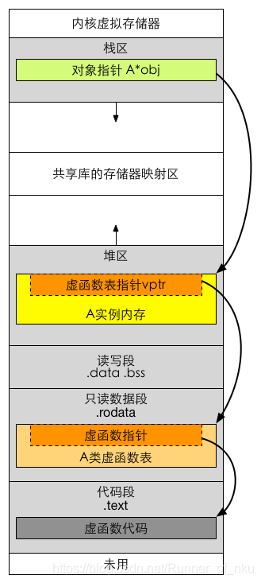

- [What Is Reflection?](#what-is-reflection)
  - [C++ RTII](#c-rtii)
  - [Java Class](#java-class)
- [C++ Reflection Implementation](#c-reflection-implementation)
  - [Naive Reflection](#naive-reflection)
  - [RTTR](#rttr)
  - [Template Meta-Programming](#template-meta-programming)
  - [Qt MOC](#qt-moc)
  - [Unreal UHT](#unreal-uht)
- [Reference](#reference)


最近在学习Unreal过程中，恍惚间觉得好多地方和Qt都有异曲同工之处，尤其是二者在反射机制的实现上。回想起之前在量化实习期间，我曾为回测系统设计过一个插件化的模型加载库。当时的核心挑战在于：如何让主系统在完全不感知具体Model类型的情况下，仅凭一个字符串类名，就完成动态链接加载、对象实例化及其成员函数的调用？这本质上就是动态链接（Dynamic Linking）+ 反射（Reflection）。今天，我将从反射的概念出发，介绍Java的反射机制实现，并结合Unreal、Qt以及C++20讨论一下如何在C++这种静态语言上优雅的实现反射。

## What Is Reflection?

反射（Reflection）是指程序在运行时具备访问、检测、修改自身的结构的能力，具体包括：

- 查询类有哪些成员变量或方法；
- 根据类名动态创建实例；
- 调用任意命名的方法，即使编译时未知。

一般来说，动态类型语言（运行时确定类型的语言，如Python、JavaScript等）都支持较为完善的反射功能，而静态类型语言（编译时确定类型的语言，如C++、Go等）通常仅支持有限的反射功能。

### C++ RTII

C++原生仅提供了RTII（Run-Time Type Identification）机制，包括：

- `typeid`运算符：获取对象的类型信息。
- `dynamic_cast`运算符：将基类指针转换为派生类指针。

究其原因，在于C++零开销抽象的设计哲学和极致扁平的内存模型。一个典型的C++类对象内存模型通常包含：

- 虚函数表指针（Vtable Pointer）：一个或多个指向虚函数表的指针，用于实现多态。通常位于对象内存的开头，也即对象指针0偏移量（g++/clang编译器的一般做法，方便访问）。
- 成员变量：类的所有成员变量，按声明顺序排列，且必须满足内存对齐要求（整个类对象大小是其所有成员变量大小的整数倍，不足部分会被填充）。

其中，普通成员函数不占用对象内存，其在编译时会被直接编码位.text段内的函数地址，调用时仅隐式传入对象指针。成员变量则会被硬编码为内存偏移量，进而保证实际访问时可通过指向.heap区的对象指针访问。至于虚成员函数访问，它则会在编译时确定其虚函数表索引，调用时则通过对象指针访问位于.rodata的虚表，进而确定实际调用的函数指针，达成多态效果。可见，一旦编译完成，原始的函数名、变量名等符号信息都会被剔除。程序虽然知道“去哪里找函数”，却彻底丢失了“函数叫什么”以及“函数长什么样”的元数据。



值得一提的是，C++虚表除了保存了相关虚函数地址，其首项通常会包含一个指向`std::type_info`对象的指针，该对象包含了类的类型信息，如类名、继承链等，是RTII机制实现的基础。

### Java Class

相比之下，同样作为静态语言的Java却拥有极其完善的反射机制。具体而言，Java反射功能实现主要依赖于`java.lang.Class`类。通过`Class.forName()`方法可以获取任意类的`Class`对象，从而可以访问该类的所有信息（如构造函数、方法、属性等）。同时，Java还提供了`java.lang.reflect`包，其中包含了一系列用于操作反射的类（如`Method`、`Field`、`Constructor`等）。

这种能力的内核在于Java特有的编译与运行机制：不同于C++直接产出极致压缩、剔除符号的二进制机器码，Java会先将.java源码编译为保留了丰富元数据的.class字节码文件，并在运行时由JVM使用动态链接器（ClassLoader）加载这些字节码文件。


从底层视角来看，Java类加载器本质上扮演了动态链接器的角色。JVM启动时并不会预先链接所有代码，只有当程序执行到`new A()`等指令时，才会触发ClassLoader去按需加载.class文件、解析符号并将其映射至进程空间。C#也采用了相似的逻辑，通过中间语言（CIL）与.NET运行时环境实现了同等级别的反射支持。

至于Python和JavaScript等动态语言，其反射特性则源于对象底层普遍基于字典的设计。以Python为例，成员访问在本质上都会被翻译为对内部字典`__dict__`的键值查找，这使得`getattr(obj, "func")`与直接调用的开销差异并不像Java那样显著，反射已然内化为了这类语言的基础执行逻辑。

## C++ Reflection Implementation

为C++添加反射能力一直是开发者长期探索的话题。由于其零开销抽象的设计哲学，编译后几乎不保留任何元数据（如类名、成员列表等），因此无法像Java或C#那样在运行时动态内省类型。所有主流C++反射方案——无论是Unreal Engine的UHT、Qt的MOC，还是开源库（如 RTTR、Boost.PFR、Magic Enum）——本质上都属于 静态反射（Static Reflection）：即在编译期或构建期生成元数据，运行时通过查表或模板展开实现的“伪反射”。

### Naive Reflection

以我提到的回测系统根据Model名称创建并调用为例，想要实现这种简单的反射，我们可以使用一个全局Map管理类名和其构造函数的键值对，并用宏帮助注册。

```c++
// reflect.h
using ModelConstructorFn = Model *(*) ();

// 用于保存Model Info的全局Map
map<string, ModelConstructorFn> miMap;

// ModelInfo类，用于保存模型信息
struct ModelInfo {
    ModelInfo(const string& name, ObjectConstructorFn ctor):
      name_(name), ctor_(ctor) {
        if (miMap.find(name) == miMap.end()) {
            miMap[name] = ctor;
        }
    }
    ~ModelInfo() {}

    string name_;
    ModelConstructorFn ctor_;
};

#define DECLARE_MODEL(name) \
  protected: \
    static ModelInfo model_info_; \
  public: \
    static Model* CreateModel();

#define IMPLEMENT_MODEL(name) \
  ModelInfo name::model_info_(#name, (ModelConstructorFn) name::CreateModel);\
  Model* name::CreateModel() { \
    return new name; \
  }
```

```c++
// model.h
// 基类Model
class Model {
 public:
    Model() {}
    virtual ~Model() {}
    
    // 接口
    virtual void OnQuote(int *) = 0;
};

// model_cta.h
// 需要支持反射的子类
class ModelCTA : public Model {
    DECLARE_MODEL(ModelCTA)
 public:
    void OnQuote(int *) {
        // ...
    }
};

// model_cta.cc
IMPLEMENT_MODEL(ModelCTA)
```

将上述宏的展开，可以得到：

```c++
// model_cta.h
class ModelCTA : public Model {
    // DECLARE_MODEL(ModelCTA)
 protected:
    static ModelInfo model_info_; 
 public:
    static Model* CreateModel();
    // ... 
};

// model_cta.cc
// IMPLEMENT_MODEL(ModelCTA)
ModelInfo ModelCTA::model_info_("ModelCTA", (ModelConstructorFn) ModelCTA::CreateModel);
Model* ModelCTA::CreateModel() {
    return new ModelCTA;
}
```

可见，我们通过宏DECLARE_MODEL在子类中额外定义了一个静态变量model_info_和CreateModel函数。由于静态变量的特性，它会在main函数之前初始化，即：会执行其构造函数中`miMap[name] = ctor;`的操作，以达成向miMap中注册信息的目的。当然，这只是最简单的反射，它还存在很多局限性，包括：无法根据类名动态的判断其内部属性是否存在、无法使用带参数的构造函数等。

事实上，仔细观察侵入式反射的例子，对于只是希望根据类名创建对象来说，其中的MapInfo类其实可以省略。只要找到某种机制向miMap写入键值对即可。比如:

```c++
// modelfactory.h
class Model;

using ModelConstructorFn = Model *(*) ();

class ModelFactory {
 public:
    static ModelFactory *GetInstance();
    Model *Create(const string &name) {
        if (miMap_ == nullptr) {
            return nullptr;
        }
        auto iter = miMap_->find(name);
        if (miMap_->end() != iter) {
            return iter->second();
        }
        return nullptr;
    }
    bool Register(const string &name, ModelConstructorFn constructor) {
        if (miMap_ == nullptr) {
            miMap_ = new map<string, ModelConstructorFn>();
        }
        auto iter = miMap_->find(name);
        if (miMap_->end() == iter) {
            miMap_->emplace(name, ctor);
            return true;
        }
        return false;
    }

 private:
    ModelFactory() {}
    ~ModelFactory() {}

    static ModelFactory *instance_;
    static map<string, ModelConstructorFn> *miMap_;
};
```

```c++
// model_cta.cc
class ModelCTA : public Model {
    // ... 
};

struct RegitserHelper {
    struct RegitserHelper(string name, ModelConstructorFn ctor) {
        ModelFactory *mf = ModelFactory::GetInstance();
        mf->Register(name, ctor);
    }
}

static RegitserHelperregister _modelcta_helper("ModelCTA", []() -> Model * { return new ModelCTA(); });
```

当然，除了使用RegisterHelper类外，我们也可以利用gcc constructor特性使得某个函数在main函数之前运行，从而达成注册Model的目的：

```c++
__attribute__((constructor)) static void initilize() {
    ModelFactory *mf = ModelFactory::GetInstance();
    mf->Register("ModelCTA", []() -> Model * { return new ModelCTA(); });
    return;
}
```

可见，C++静态反射的本质就在于，在编译期就将类的信息写入某个元数据字典（Metadata Dictionary）中，从而保证运行时能够根据名称从该表中获取属性偏移量/函数指针进行访问/调用。具体而言，这些信息包含：

- 类名 → 构造/析构函数；
- 类名 + 成员变量名 → 偏移量 + 类型信息；
- 类名 + 成员函数名 → 函数指针 + 参数签名；

不过上述例子中给出的两种注册手段（宏+静态对象构造函数/gcc constructor特性）缺点也较为明显。若仅依靠宏进行文本替换的话，二者根本无法掌握类中各成员变量的类型、成员函数的参数签名等信息，必须依靠手动编写代码进行注册。

### RTTR

运行时类型信息反射（Run Time Type Reflection, [RTTR](https://www.rttr.org/doc/master/index.html)）是一套纯C++实现的反射解决方案。受限于C++语言本身不支持自动遍历类成员的特性，RTTR必须手动显式注册所有需要反射的类、属性、方法。比如：

```c++
#include <rttr/registration>
using namespace rttr;

class Person {
public:
    std::string name;
    int age;
    void say_hello() { std::cout << "Hello: " << name << std::endl; }
};

// 必须手动注册：类名、属性、方法
RTTR_REGISTRATION
{
    registration::class_<Person>("Person")
        .property("name", &Person::name)  // 手动绑定属性
        .property("age", &Person::age)
        .method("say_hello", &Person::say_hello); // 手动绑定方法
}
```

### Template Meta-Programming

模板元编程是基于C++模板特性实现的编译期反射方案，核心是利用模板递归遍历、类型萃取等能力，在编译阶段解析类的成员结构并生成反射相关代码。该方案无需运行时查找或外部工具依赖，所有反射逻辑均在编译期完成，运行时无额外开销，且能通过编译期类型检查保证类型安全，常被用于序列化 / 反序列化、静态类型校验等场景。

### Qt MOC

与仅依靠原生C++功能所实现的反射方案不同，Qt为了避免手动注册引入了第三方工具，也即MOC（Meta-Object Compiler）在编译期自动生成反射代码。具体而言，该工具会扫描头文件，识别包含Q_OBJECT的类，提取类的继承关系、信号槽函数、属性等信息，并根据这些信息生成对应的反射代码，也即__moc.cpp

**Q_OBJECT/Q_PROPERTY**

Q_OBJECT与Q_PROPERTY是Qt框架中用于实现反射的两个重要宏。

- Q_OBJECT宏用于声明一个类为Qt的元对象类，从而使该类能够利用Qt的信号槽机制、属性系统等功能。
- Q_PROPERTY宏用于声明一个类的属性，包括属性名、属性类型、属性访问权限等。

```c++
class Model : public QObject {
    Q_OBJECT
public:
    Model(QObject *parent = nullptr) : QObject(parent) {}
    virtual ~Model() {}

    QString name() const { return name_; }
    void setName(const QString &name) {
        if (name_ != name) {
            name_ = name;
            emit nameChanged(name_);
        }
    }
private:
    Q_PROPERTY(QString name READ name WRITE setName NOTIFY nameChanged)
    QString name_;
};
```

**Signal & Slot**

信号槽函数（Signal-Slot）是Qt框架中用于实现对象间通信的机制，利用MOC自动生成的反射代码，使得信号槽函数的调用在编译期就能够被检查和优化，避免了运行时的动态查找和调用。

### Unreal UHT

## Reference

- [C++类内存布局](https://zhuanlan.zhihu.com/p/626262677)
- [如何优雅的实现C++编译器反射](https://netcan.github.io/2020/08/01/%E5%A6%82%E4%BD%95%E4%BC%98%E9%9B%85%E7%9A%84%E5%AE%9E%E7%8E%B0C-%E7%BC%96%E8%AF%91%E6%9C%9F%E9%9D%99%E6%80%81%E5%8F%8D%E5%B0%84/)
- [C++无宏静态反射全解析](https://zhuanlan.zhihu.com/p/1931120499179647603)
- [otas_serialization](https://github.com/maoliangcd/otas_serialization)
- [yalantinglibs struct_pack](https://alibaba.github.io/yalantinglibs/zh/struct_pack/struct_pack_intro.html)